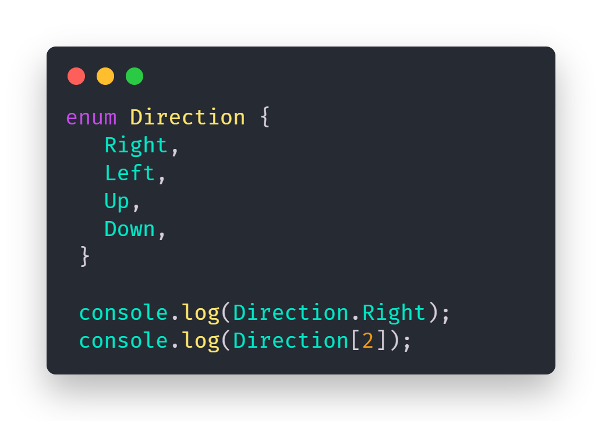
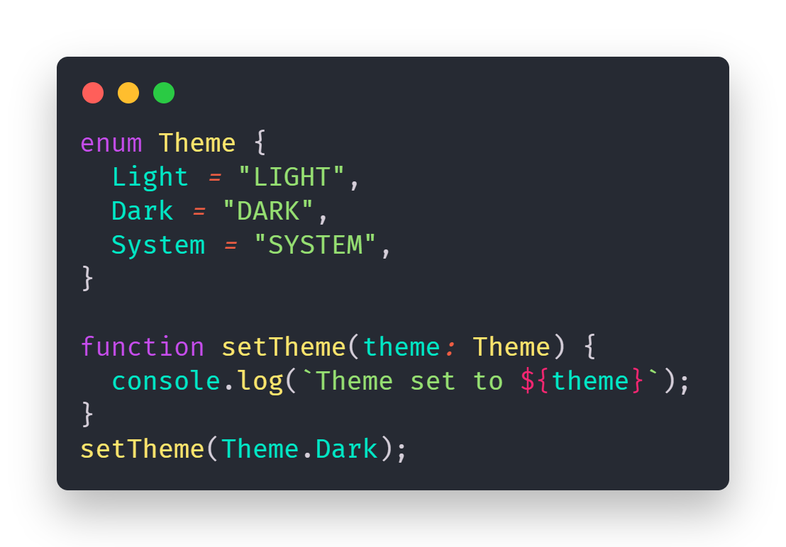
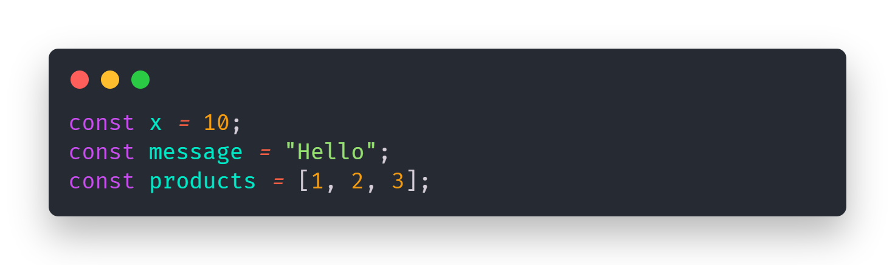

### 🏴 Note: In the `src` folder, you'll find my `Solution.ts` file containing the Assignment 1 submission. I've also written two impactful blog posts about Question 4 and Question 5, which are included below.

## 1. What is the use of `enums` in TypeScript? Provide an example of a numeric and string enum.

When I encountered enums in my TypeScript assignment 1, I was completely lost. I had no idea what they were or how to use them. After hours of research through YouTube tutorials and StackOverflow threads, I finally grasped this powerful feature and wanted to share my findings.

### 🔹 What are Enums?

Enums (short for enumerations) in TypeScript allow developers to define a set of named constants. They provide a way to organize related values and make code more readable and maintainable. Instead of using arbitrary numbers or strings throughout our codebase, enums offer descriptive names with fixed values.

### 🔹 Numeric Enums

The most basic type is the numeric enum, where TypeScript assigns increasing numeric values starting from 0:

### 🔹 String Enums

String enums assign string values to each member, making debugging easier:

### 🔹 Why Use Enums?

After working with enums, I've found they're especially valuable for:

1. Code clarity - They make intent obvious with descriptive names.
2. Type safety - TypeScript ensures variables only accept enum values.
3. Intellisense support - Editors provide autocomplete for enum members.
4. Preventing bugs - No more typos or invalid values.

Whether we are defining API status codes, user roles, or application states, enums help create more robust, maintainable code.

## 2. What is type inference in TypeScript? Why is it helpful?

TypeScript's type inference automatically deduces variable and expression types without explicit declarations, enhancing code readability and safety.
Basic Inference:

### 🔹 Why This Rocks?:

1. Less typing = less work.
2. Fewer chances to mess up.
3. Code looks cleaner.
4. Code editor can give us better hints.

### 🔹 How it Works?:

When give a variable a value, TypeScript looks at that value and says "I bet this is supposed to be a string/number/whatever!"
Some Neat Tricks:
If i make an array, TypeScript knows what's in it:

`let favColors = ["blue", "green", "purple"];`

`function double(num) { 
  return num * 2;
}`

### 🔹 When a Dev in Stuck:

Sometimes TypeScript gets confused, and that's okay! You and me can always help it:

`let scores: number[] = [];`

### 🔹 Pro Tip as a Beginners:

Let TypeScript do the work when it can, but don't be afraid to add types when things get confusing.
Remember: Type inference is just TypeScript being our helpful buddy, trying to make coding easier.

### 🔹 Conclusion of boths:

Understanding enums and type inference has made my TypeScript journey much smoother. Enums helped me write clearer, more reliable code by replacing magic values with meaningful names. Meanwhile, type inference reduced the need for repetitive type declarations and made my code feel smarter and cleaner.

### Sources

I learned about **Enums** and **Type Inference** in TypeScript from the following resources:

1. [Enums in TypeScript](https://refine.dev/blog/typescript-enum/#tldr)

2. [Types vs Interfaces in TypeScript](https://blog.logrocket.com/types-vs-interfaces-typescript/)
